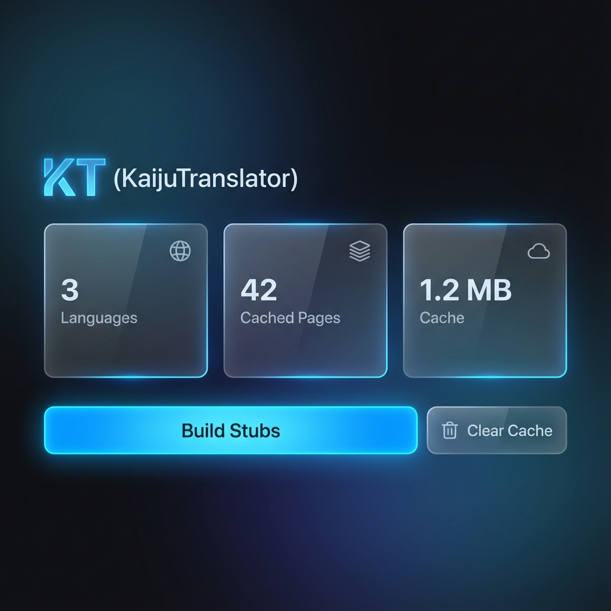

# 🦖 KT (KaijuTranslator)

**The AI-Powered, "Dummy-Proof" Translation Engine for PHP Websites.** 🌍✨

KT is an isolated, plug-and-play engine that transforms your entire PHP website into a multilingual powerhouse in seconds. Leveraging **OpenAI (GPT-4o)**, **DeepSeek**, and **Google Gemini**, KT handles the heavy lifting of translation while you focus on your code.

---

## 🚀 Why KT?

- **🧠 Multi-AI Brain**: Choose between **OpenAI**, **DeepSeek**, or **Gemini**. Get the best translations for every language.
- **⚡ Zero Config Headache**: Drop it in, run the setup, and go global. No `.htaccess` magic required.
- **🎨 Premium Visual Dashboard**: Manage your translations from a beautiful, glassmorphism console.
- **🔍 SEO Master**: Built-in automated `hreflang` tags, canonicals, and XML Sitemaps.
- **🛡️ Stealth Mode**: 100% isolated. Your original code stays untouched. Delete the `KT/` folder, and it's like we were never there.

---

## 🛠️ Quick Start (3 Steps)

### 1. Upload

Drop the `KT/` folder, `setup.php`, and `uninstall.php` into your website's root.

### 2. Configure (AI Ready)

Open `yoursite.com/setup.php` in your browser. Select your preferred **AI Provider** and enter your API Key.

### 3. Build & Thrive

Visit the **KT Dashboard** at `yoursite.com/KT/dashboard.php` and click **"Build Stubs"**. KT will automatically discover your pages and create SEO-optimized language mirrors.

---

## 💎 Features at a Glance

### 🦾 AI-First Translation

KT doesn't just replace words. It uses LLMs to understand context, ensuring your technical terms and nuances are preserved across all languages.

### 🛡️ Smart Fallback (Safety First)

If your AI API key expires or hits a limit, KT **fails gracefully**. Your site stays online with original content while maintaining all SEO headers. No 404s, no crashes.

### 🧹 Clean Architecture

Your language folders (`/en/`, `/fr/`, etc.) stay 100% clean. KT only generates the minimal entry points needed for search engines to index your translated content.

---

## 🤝 Contributing

KT is mission-critical for the global PHP community. If you have an idea to make it even more "Dummy-Proof", feel free to open a PR!

## 📄 License

This project is licensed under the MIT License - see the [LICENSE](LICENSE) file for details.

---
**Build the global web, one AI prompt at a time.** 🦖🌍
